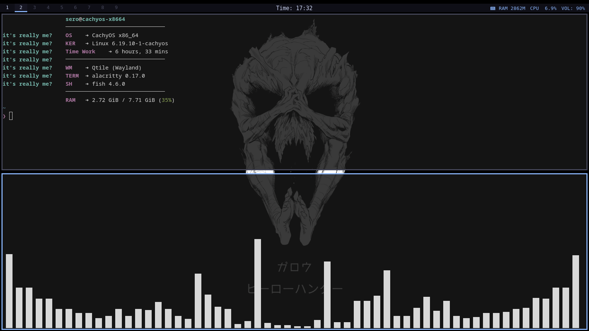
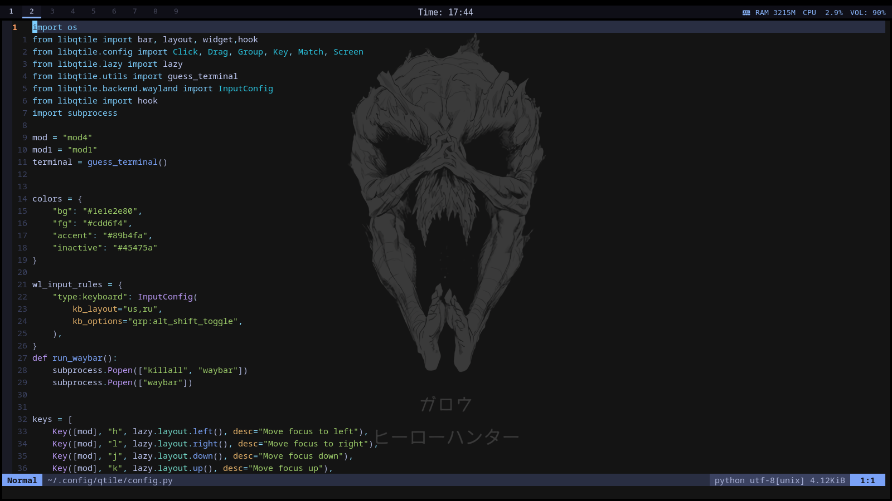
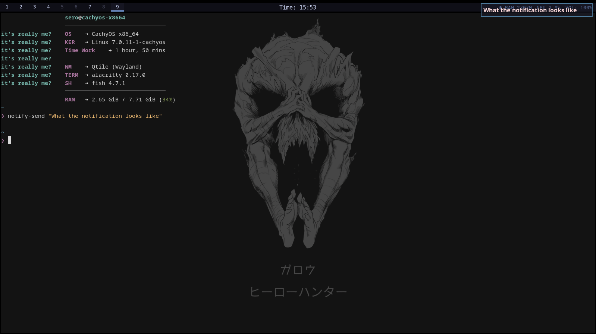

<h3 align="center">♻️🐧 Minimalist Qtile (Wayland) 🐧♻️</h3>

This repository contains my personal configuration files for Qtile window manager running on Wayland. Designed for simplicity, performance, and low resource usage.

  

## 📘 About My Setup
A clean, efficient environment focused on productivity.

- OS: [**`Cachyos`**](https://github.com/CachyOS)
 - WM: [**`Qtile (Wayladn)`**](https://github.com/qtile/qtile)
 - Bar: [**`Qtile bar`**](https://docs.qtile.org/en/stable/manual/ref/widgets.html)
 - Terminal: [**`Alacritty`**](https://github.com/alacritty/alacritty)
 - App Launcher: [**`Rofi`**](https://github.com/davatorium/rofi)
 - Shell: [**`Fish`**](https://github.com/fish-shell/fish-shell)
 - File meneger: [**`Yazi`**](https://github.com/sxyazi/yazi)
 - notification: [**`Mako`**](https://github.com/emersion/mako)

## The Code
The Qtile configuration is written entirely in Python, keeping it under 150 lines of clean, readable code.

  

# Mako

  

## Firefox

  
  

## 🎱 How to use ??
- 1.`git clone https://github.com/sudo-pacman-Syy/Qtile-Wayland-Arch-based-linux.git`
- 2.`cd Qtile-Wayland-Arch-based-linux`
- 3.`sudo ./install.sh`
- 4.`Suped + ctrl + r`

## 🗲 Command Qtile 
- `super + enter` open terminal
- `super + h + j + k + l` moving by terminal
- `super + '+'` control sound (up)
- `super + '-'` control sound (down)
- `super + control + r` restart qtile
- `super + w` kill focused window
- `super + taq` change layout
- `super + alt` open rofi
- `PRTSC` print screen

